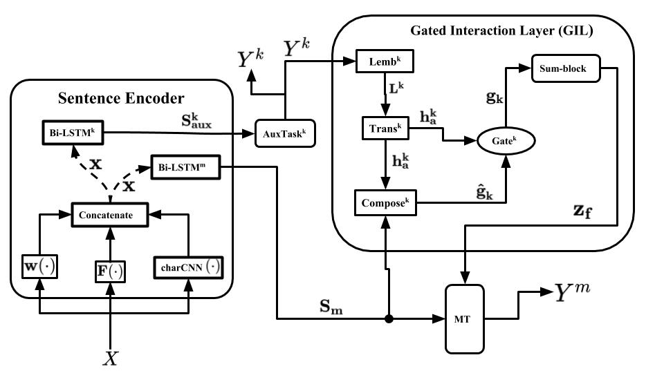
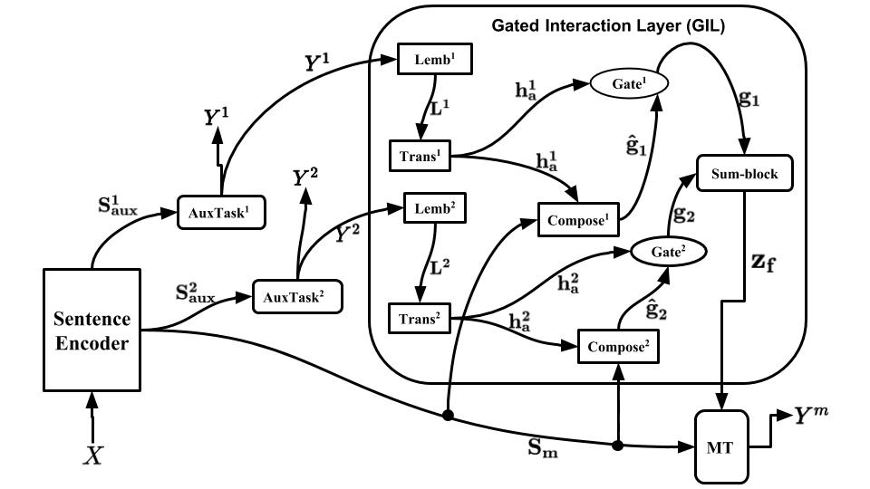

This repository contains the source code paper for our paper:  Gated Task Interaction Framework for Multi-task Sequence Tagging.   
We use the GLOVE word embedding which can be downloaded by using a simple downloader: https://github.com/chakki-works/chakin
## Figures
 

The basic form of the GTI architecture with a main-task  and one auxiliary task  .

The GTI architecture with two auxiliary tasks sub-networks ( and   generating the output labels  and  respectively) and a single main/target task sub-network (  generating the labels for the main Task ).

## Dataset
